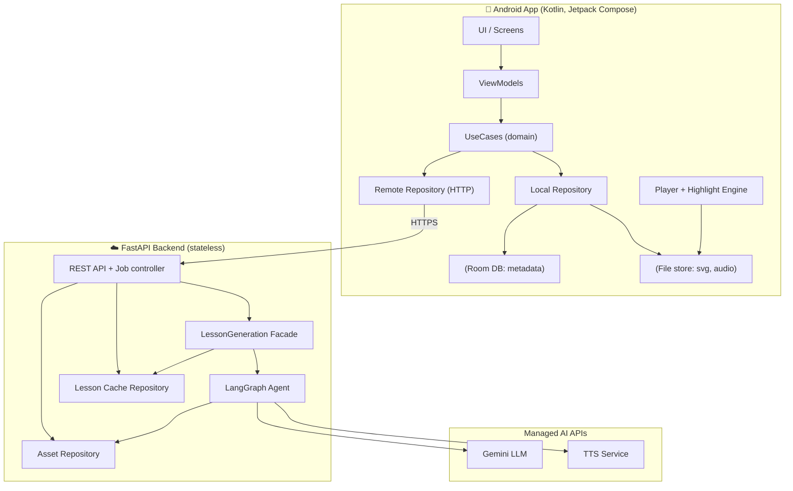
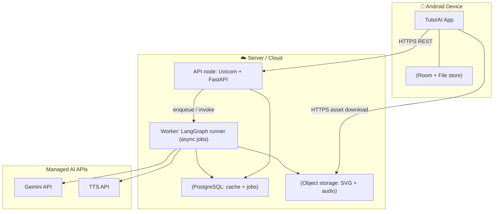

# 02 — Architecture

## 2.1 Style

- **Client–server.** Thin-ish Android client, stateless FastAPI backend.
- **Stateless backend + shared cache.** No per-user state; lessons are cached by a
  normalized topic key and assets live in object storage.
- **Agentic generation.** A LangGraph pipeline orchestrates Gemini (LLM) and TTS
  with validation/repair loops.
- **Offline-first client.** Once a lesson is downloaded it is fully self-contained
  on the device.

## 2.2 Component diagram

## 2.3 Deployment diagram

> **Dev profile:** the "Worker" can run in-process as a FastAPI `BackgroundTask`, and
> object storage can be the local filesystem. The interfaces stay identical so we can
> promote to a separate worker + S3/GCS without touching call sites.

## 2.4 Technology stack

| Layer | Choice | Notes |
|---|---|---|
| Mobile UI | Kotlin + Jetpack Compose | Declarative, modern |
| Mobile arch | MVVM + Clean Architecture | Testable, layered |
| Mobile storage | Room + file store | Metadata + binary assets |
| Mobile audio | ExoPlayer (Media3) | Per-segment clip playback |
| Mobile SVG | AndroidSVG or WebView renderer | Must expose element IDs for highlight |
| API | FastAPI + Uvicorn | Async, typed |
| Validation | Pydantic v2 | DTOs / schemas |
| Orchestration | LangChain + LangGraph | Agent graph + state |
| LLM | Gemini (Flash-class) via adapter | **Confirm exact model id against the live API; pin in config** |
| TTS | TTS service via adapter | Returns audio bytes + duration |
| Cache DB | PostgreSQL (SQLite in dev) | Lessons + jobs |
| Assets | Object storage (filesystem in dev) | SVG + audio clips |

> ⚠️ **Model IDs change.** Treat the Gemini model name as configuration. Verify the
> currently available Flash-class model via the API at build time and pin it in
> settings; the provider adapter makes swapping it a one-line change.

## 2.5 Cross-cutting concerns

- **Config:** 12-factor; all secrets/model IDs via environment, surfaced through a typed `Settings` object.
- **Logging/observability:** structured logs, per-job correlation ID, node-level timings, token/cost counters.
- **Error handling:** typed domain errors → consistent API error envelope (see [06](06-api-contract.md)).
- **Idempotency:** generation keyed by normalized topic; concurrent identical requests coalesce onto one job.
- **Security:** HTTPS, input length/validation, prompt-injection-aware SVG sanitization, asset access via signed/scoped URLs.
- **Testing:** providers mockable; graph nodes unit-tested; contract tests on the API; instrumentation tests on the player.
