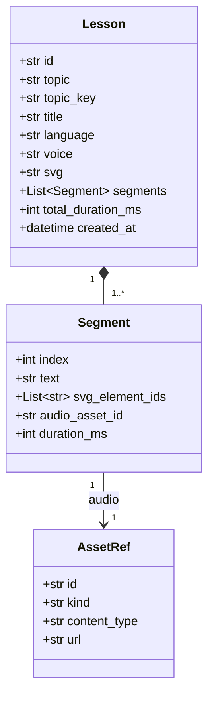
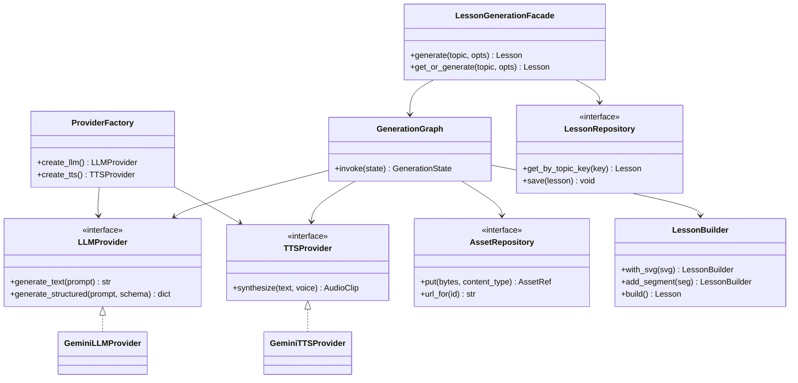
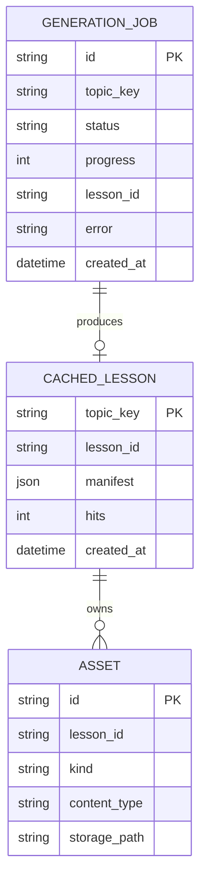
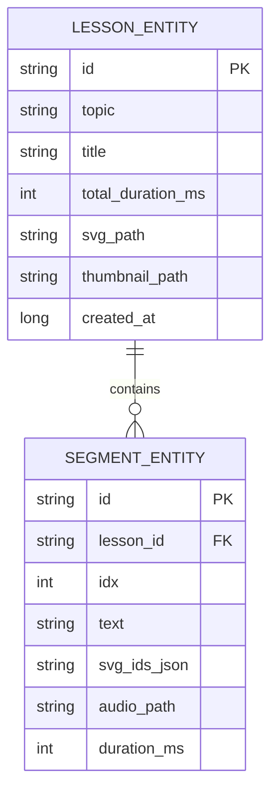

# 03 — Domain Model

## 3.1 Core entities (backend)



**Invariants**

- `Lesson.svg` is well-formed XML with a `viewBox`.
- Every `Segment.svg_element_ids` value exists as an `id` in `Lesson.svg`.
- `total_duration_ms == sum(segment.duration_ms)`.
- Segments are contiguous and ordered by `index` starting at 0.

## 3.2 Backend service & provider classes



See [04 — AI Agent Design](04-ai-agent-design.md) for which design pattern each class implements.

## 3.3 Backend persistence (ER)



- `topic_key` = normalized topic (lowercased, trimmed, collapsed whitespace,
  optionally language-suffixed) — the cache + idempotency key.
- `GENERATION_JOB.status` ∈ `{queued, running, succeeded, failed}`.
- `ASSET.kind` ∈ `{svg, audio}`.

## 3.4 On-device persistence (Room ER)



- `svg_path`, `audio_path` point at files in app-private storage.
- `svg_ids_json` is the JSON-encoded `List<String>` of element IDs for the segment.

## 3.5 Lesson manifest (the wire/storage contract)

The manifest is what the API returns and what the device persists. Asset URLs are
resolvable for download; after download the device rewrites them to local paths.

```json
{
  "id": "les_8f3a...",
  "topic": "Photosynthesis",
  "title": "How Photosynthesis Works",
  "language": "en",
  "voice": "en-US-neutral",
  "total_duration_ms": 41200,
  "created_at": "2026-06-25T10:00:00Z",
  "svg": {
    "asset_id": "ast_svg_01",
    "url": "https://.../assets/ast_svg_01"
  },
  "segments": [
    {
      "index": 0,
      "text": "Sunlight strikes the leaf and is captured by the plant.",
      "svg_element_ids": ["sun", "leaf"],
      "audio": { "asset_id": "ast_aud_00", "url": "https://.../assets/ast_aud_00" },
      "duration_ms": 4200
    },
    {
      "index": 1,
      "text": "Chlorophyll inside the chloroplasts absorbs that light energy.",
      "svg_element_ids": ["chloroplast", "chlorophyll"],
      "audio": { "asset_id": "ast_aud_01", "url": "https://.../assets/ast_aud_01" },
      "duration_ms": 3100
    }
  ]
}
```

> The SVG may be inlined as a string instead of an asset URL for small diagrams; the
> manifest supports either. Audio is always a downloadable asset.
