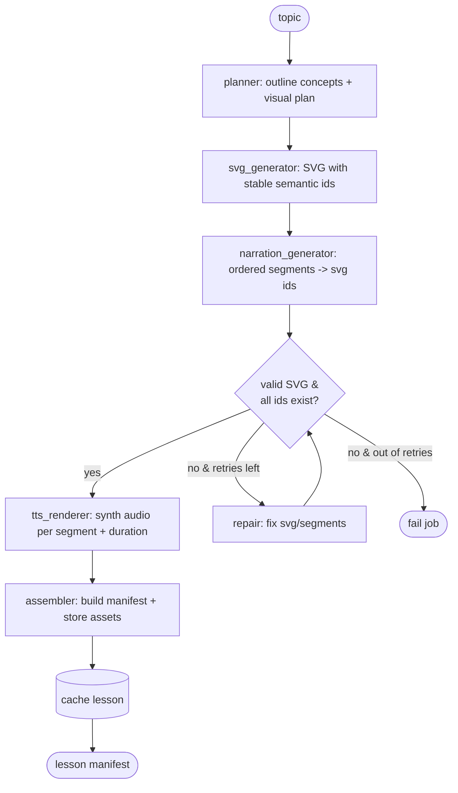
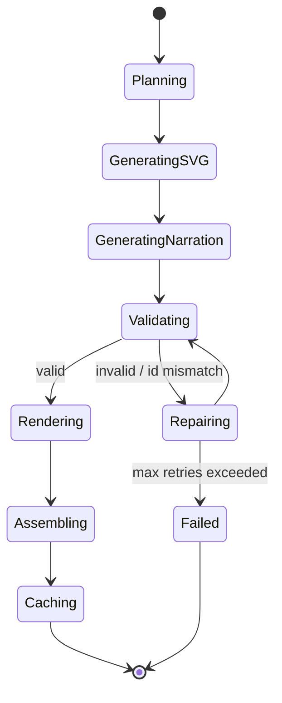

# 04 — AI Agent Design (LangChain + LangGraph)

## 4.1 Goal

Turn a topic string into a **validated, self-consistent lesson**: an SVG with stable
IDs, narration segments that reference only IDs that exist, and per-segment audio.
The graph must *fail safe* — never cache a lesson whose narration points at
non-existent SVG parts.

## 4.2 The graph

## 4.3 Generation lifecycle (state machine)

## 4.4 Agent state

A single typed state object flows through the graph (LangGraph `TypedDict` / Pydantic):

| Field | Type | Set by |
|---|---|---|
| `topic` | str | entry |
| `options` | dict (language, voice) | entry |
| `plan` | ConceptPlan | planner |
| `svg` | str | svg_generator / repair |
| `segments` | list[Segment] (no audio yet) | narration_generator / repair |
| `validation` | ValidationResult | validator |
| `retries` | int | repair loop |
| `rendered` | list[RenderedSegment] (audio + duration) | tts_renderer |
| `lesson` | Lesson | assembler |
| `error` | str? | any node on hard failure |

## 4.5 Node responsibilities

| Node | Input | Output | Notes |
|---|---|---|---|
| `planner` | topic | concept list + visual layout plan | Keeps SVG and narration aligned to the same concept set |
| `svg_generator` | plan | SVG string with `id` per concept element | IDs are semantic & stable (`sun`, `leaf`, `chloroplast`) |
| `narration_generator` | plan + svg | ordered segments, each → existing svg ids | Structured output validated against schema |
| `validator` | svg + segments | ValidationResult (well-formed? viewBox? ids exist? coverage?) | Deterministic, no LLM; pure parser checks |
| `repair` | svg + segments + errors | corrected svg/segments | Targeted fix prompt; bounded by `max_retries` |
| `tts_renderer` | segments | audio bytes + measured duration per segment | Deterministic I/O; parallelizable per segment |
| `assembler` | everything | Lesson + stored assets | Uses `LessonBuilder`; persists via repositories |

**Validator checks (no LLM):**
1. SVG parses as XML and has a `viewBox`.
2. Every `svg_element_ids` referenced by a segment exists as an `id` in the SVG.
3. (Soft) Coverage — flag major SVG elements never referenced by any segment.
4. Segments are ordered, contiguous, non-empty.

## 4.6 Design patterns

| Pattern | Where | Why |
|---|---|---|
| **Strategy** | `LLMProvider`, `TTSProvider` interfaces | Swap Gemini / TTS without touching the graph |
| **Abstract Factory** | `ProviderFactory` | Build a coherent provider set from config |
| **Adapter** | `GeminiLLMProvider`, `GeminiTTSProvider` | Wrap external SDKs behind our interface |
| **Builder** | `LessonBuilder` | Assemble a valid `Lesson` incrementally |
| **Repository** | `LessonRepository`, `AssetRepository` | Hide cache DB / object storage behind interfaces |
| **Facade** | `LessonGenerationFacade` | One entry point over cache-check + graph + persist |
| **Pipeline / Chain** | LangGraph nodes + conditional edges | Natural fit for staged generation + repair loops |
| **Template Method** | base node behavior (logging, retry, timing) | Consistent node lifecycle |
| **DTO** | Pydantic request/response + manifest | Typed boundaries |
| **Dependency Injection** | FastAPI `Depends` wiring providers/repos | Testability, mockability |

## 4.7 Prompting strategy (high level)

- **Stable IDs contract:** the SVG prompt instructs the model to assign a semantic
  `id` to every meaningful visual element and to return *only* SVG. The narration
  prompt is given the produced SVG and must reference only IDs present in it.
- **Structured output:** narration is requested as schema-constrained JSON
  (segments with `text` + `svg_element_ids`), validated by Pydantic.
- **Repair prompt:** on validation failure, the repair node receives the exact list
  of offending IDs / parse errors and is asked to make the *minimal* correction.
- **Determinism:** low temperature for SVG/validation-sensitive steps; bounded
  `max_retries` (e.g. 2) to cap cost and latency.

## 4.8 Why a graph (not a single prompt)

- Separating SVG and narration lets each step be **validated and repaired in isolation**.
- The **repair loop** is the reliability backbone — it guarantees the cached lesson
  satisfies the "every referenced ID exists" invariant from [03](03-domain-model.md).
- Nodes are independently testable and the TTS step is **parallelizable**.
