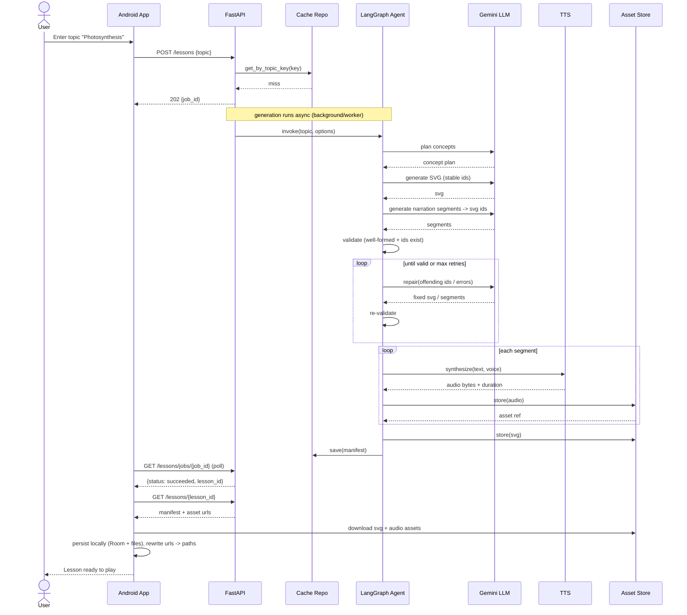
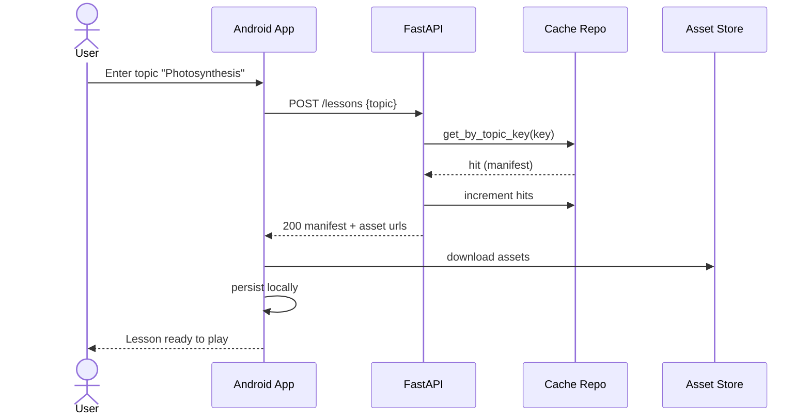
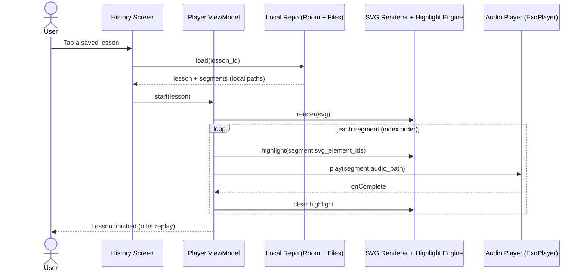
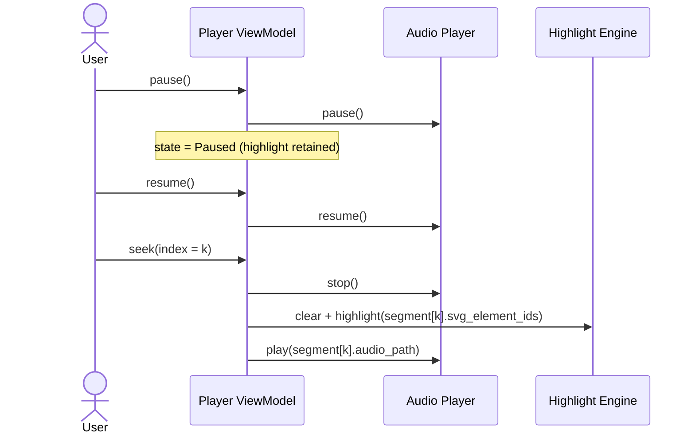
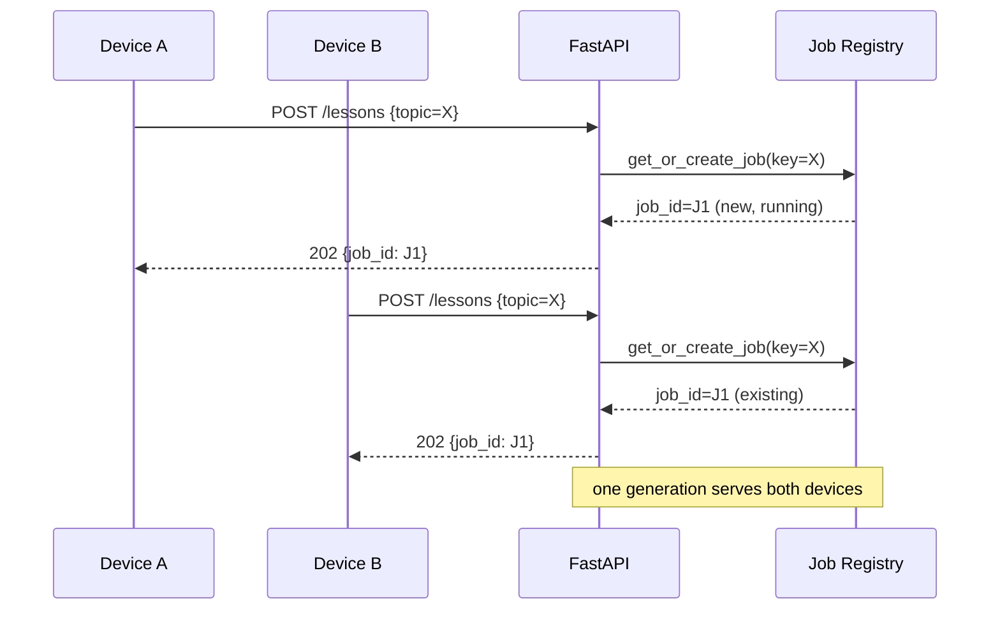

# 05 — Sequence Diagrams

## 5.1 Lesson generation (cache miss)

## 5.2 Lesson generation (cache hit)

## 5.3 Offline playback with highlight sync

## 5.4 Pause / resume / seek

## 5.5 Coalesced concurrent requests (same topic)

