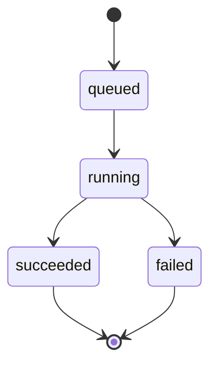

# 06 — API Contract

Base path: `/api/v1`. JSON over HTTPS. Generation is async (job-based) because a cold
lesson can take seconds; cache hits return immediately.

## 6.1 Endpoints

| Method | Path | Purpose | Success |
|---|---|---|---|
| `POST` | `/lessons` | Request a lesson for a topic | `200` (cache hit, manifest) or `202` (job started) |
| `GET` | `/lessons/jobs/{job_id}` | Poll job status | `200` job status |
| `GET` | `/lessons/{lesson_id}` | Fetch a lesson manifest | `200` manifest |
| `GET` | `/assets/{asset_id}` | Download an asset (svg/audio) | `200` bytes |
| `GET` | `/healthz` | Liveness/readiness | `200` |

> Optional enhancement: `GET /lessons/jobs/{job_id}/events` (SSE) to stream progress
> instead of polling. Polling is the v1 default for simplicity.

## 6.2 Request / response schemas (Pydantic)

**POST /lessons — request**
```json
{
  "topic": "Photosynthesis",
  "language": "en",      // optional, default "en"
  "voice": "en-US-neutral" // optional
}
```

**POST /lessons — 202 (generation started)**
```json
{ "job_id": "job_3c1...", "status": "queued", "topic_key": "photosynthesis|en" }
```

**POST /lessons — 200 (cache hit)** → returns a **Lesson manifest** (see [03](03-domain-model.md#35-lesson-manifest-the-wirestorage-contract)).

**GET /lessons/jobs/{job_id} — 200**
```json
{
  "job_id": "job_3c1...",
  "status": "running",          // queued | running | succeeded | failed
  "progress": 60,                // 0..100
  "stage": "tts_rendering",      // planning | svg | narration | validating | tts_rendering | assembling
  "lesson_id": null,             // set when succeeded
  "error": null                  // set when failed
}
```

**GET /lessons/{lesson_id} — 200** → **Lesson manifest**.

## 6.3 Job model



- Polling interval suggestion: client polls every ~1.5 s with backoff until terminal.
- Jobs are keyed by `topic_key`; identical concurrent topics share one job (see [05.5](05-sequence-diagrams.md#55-coalesced-concurrent-requests-same-topic)).

## 6.4 Error envelope

All errors share one shape:
```json
{
  "error": {
    "code": "GENERATION_FAILED",
    "message": "Could not produce a valid diagram for this topic.",
    "retryable": true,
    "request_id": "req_9a2..."
  }
}
```

| HTTP | `code` | When |
|---|---|---|
| 400 | `INVALID_TOPIC` | empty / too long / unsupported chars |
| 404 | `LESSON_NOT_FOUND` / `JOB_NOT_FOUND` | unknown id |
| 422 | `VALIDATION_ERROR` | malformed request body |
| 429 | `RATE_LIMITED` | too many requests |
| 500 | `GENERATION_FAILED` | graph exhausted repair retries / provider error |
| 503 | `PROVIDER_UNAVAILABLE` | upstream AI API down |

## 6.5 Conventions

- **Versioning:** path-based (`/api/v1`). Breaking changes → `/v2`.
- **Idempotency:** `POST /lessons` is idempotent per `topic_key`; repeats return the same job or cached lesson.
- **Asset URLs:** scoped/signed, time-limited; the device downloads once then uses local paths.
- **Pagination:** not needed in v1 (history is device-local).
- **Auth:** none in v1 (no accounts); reserve a header slot for a future API key.
