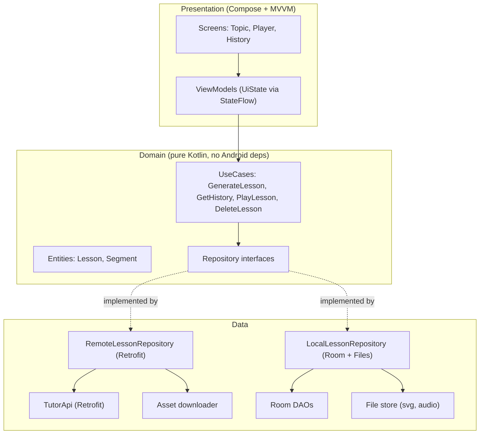
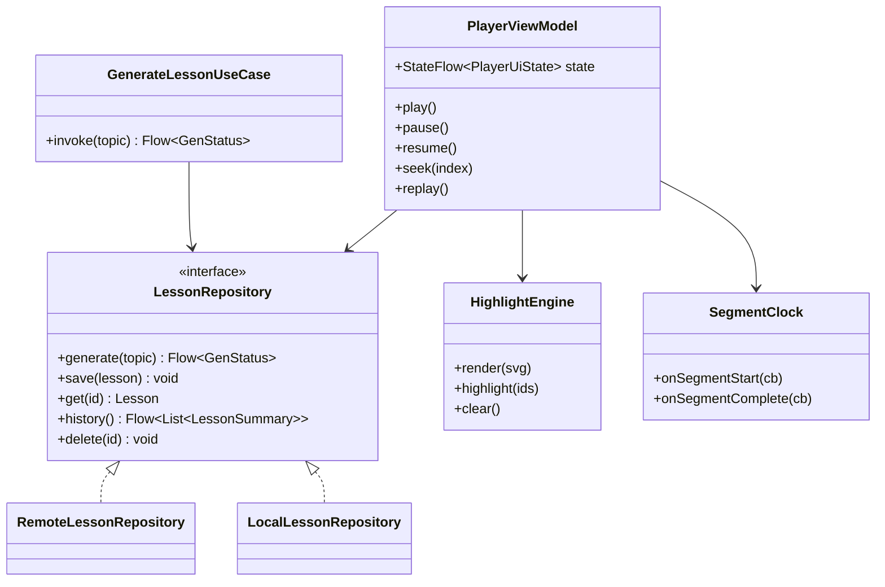
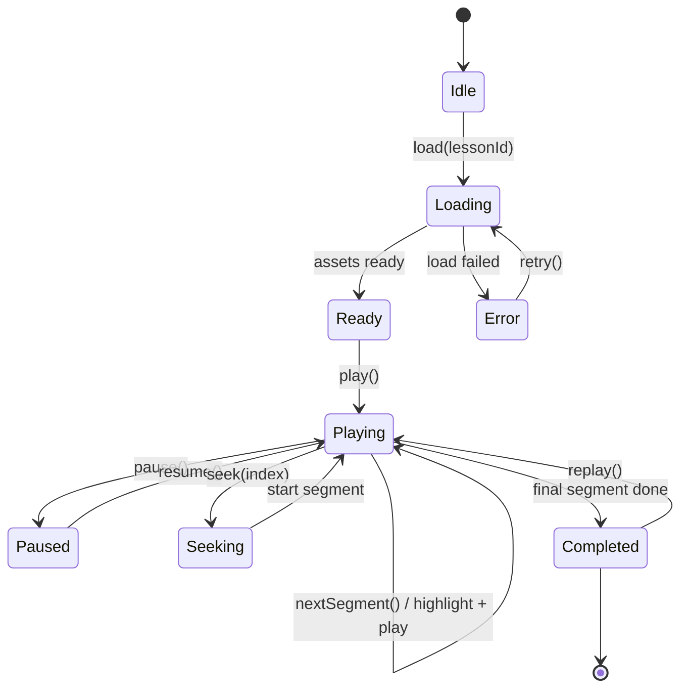

# 07 — Android Architecture

## 7.1 Layers (Clean Architecture + MVVM)

**Rules**

- Presentation depends on Domain only; Data implements Domain's repository interfaces (dependency inversion).
- ViewModels expose a single immutable `UiState` via `StateFlow`; UI is a pure function of state.
- DI via Hilt; the `Repository` interfaces are the seams for testing.

## 7.2 Module / class sketch

## 7.3 Player state machine

**Sync loop (per segment):** `highlight(segment.svg_element_ids)` → `play(segment.audio)`
→ on `ExoPlayer` completion: `clear()` then advance. Because each clip's duration is
known and the highlight is driven by clip start/end, sync is deterministic and needs
no network or word-level timing.

## 7.4 SVG rendering + highlight engine

Two candidate renderers — decide in Phase 6 with a spike:

| Option | Highlight mechanism | Pros | Cons |
|---|---|---|---|
| **WebView + inline SVG/JS** | `document.getElementById(id)` → toggle CSS class | Full CSS animation; trivial ID lookup | Heavier; JS bridge |
| **AndroidSVG → Canvas** | Pre-parse element bounds by `id`; redraw emphasis | Native, light | Manual highlight rendering; limited effects |

**Recommendation:** start with **WebView + inline SVG** for the richest highlighting
(glow/outline/pulse via CSS), revisit if performance requires the native path. The
highlight engine is behind an interface so the renderer can be swapped.

## 7.5 Local persistence & offline

- **Room** stores `LESSON_ENTITY` + `SEGMENT_ENTITY` (see [03.4](03-domain-model.md#34-on-device-persistence-room-er)).
- **File store** (app-private) holds the SVG and per-segment audio clips.
- On download, asset URLs in the manifest are rewritten to **local file paths**, so
  playback never touches the network.
- History screen reads from Room (`Flow`), newest first; delete removes both rows and files.

## 7.6 Screens

| Screen | Responsibility |
|---|---|
| **Topic** | Input + submit; shows generation progress (job polling) |
| **Player** | SVG canvas, highlight, transcript/caption, transport controls |
| **History** | List of saved lessons; tap → Player; swipe → delete |
