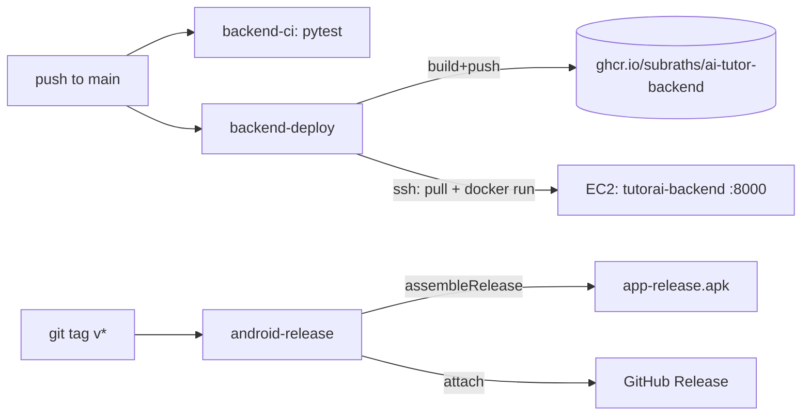

# 09 — CI/CD

GitHub Actions in [`.github/workflows/`](../.github/workflows/). Path filters mean
backend changes only run backend jobs and vice-versa.

| Workflow | Trigger | What it does |
|---|---|---|
| `backend-ci` | PR / push to `main` (`backend/**`) | `pytest` + `docker build` sanity |
| `backend-deploy` | push to `main` (`backend/**`), manual | Build image → push to **GHCR** → SSH deploy on **EC2** |
| `android-ci` | PR / push to `main` (`android/**`) | `:app:assembleDebug`, uploads debug APK artifact |
| `android-release` | tag `v*`, manual | Build (signed) release APK → attach to a **GitHub Release** |

## Architecture



## Required GitHub secrets

Repo → Settings → Secrets and variables → Actions.

| Secret | Used by | Notes |
|---|---|---|
| `EC2_HOST` | backend-deploy | EC2 public IP / DNS |
| `EC2_USER` | backend-deploy | e.g. `ec2-user` (Amazon Linux) or `ubuntu` |
| `EC2_SSH_KEY` | backend-deploy | **private** key (PEM) for that user |
| `GEMINI_API_KEY` | backend-deploy | injected as `TUTOR_GEMINI_API_KEY` |
| `BACKEND_BASE_URL` | android-release | e.g. `http://<EC2_IP>:8000/` — baked into the release APK |
| `ANDROID_KEYSTORE_BASE64` | android-release | `base64 -w0 release.keystore` (optional*) |
| `ANDROID_KEYSTORE_PASSWORD` | android-release | optional* |
| `ANDROID_KEY_ALIAS` | android-release | optional* |
| `ANDROID_KEY_PASSWORD` | android-release | optional* |

`GITHUB_TOKEN` is automatic (used to push to GHCR and create Releases).

\* If the keystore secrets are absent, the release build falls back to the **debug**
signing key so the APK is still installable. Provide them for a properly-signed
release.

## One-time EC2 setup

```bash
# Amazon Linux 2023
sudo dnf -y install docker
sudo systemctl enable --now docker
sudo usermod -aG docker ec2-user        # re-login afterwards
```

- Open inbound **TCP 8000** in the instance's security group.
- The deploy job logs in to GHCR with `GITHUB_TOKEN`; if the package is **private**
  ensure it's linked to this repo (it is, by default). Otherwise make the GHCR
  package public (Packages → package → visibility).
- Data persists in the `tutor-data` Docker volume (filesystem storage backend).

> For HTTPS, put Nginx/Caddy in front of `:8000` with a TLS cert and point
> `BACKEND_BASE_URL` at `https://your-domain/`. (Out of scope for v1.)

## Generating a release keystore

```bash
keytool -genkeypair -v -keystore release.keystore -alias tutorai \
  -keyalg RSA -keysize 2048 -validity 10000
base64 -w0 release.keystore           # -> ANDROID_KEYSTORE_BASE64
```

Then set `ANDROID_KEY_ALIAS=tutorai` and the two passwords as secrets.

## Cutting a release

```bash
git tag v1.0.0
git push origin v1.0.0     # triggers android-release -> GitHub Release with the APK
```

## Activation checklist

1. Commit and push these files to `main` (workflows only run from the default branch / PRs).
2. Add the secrets above.
3. Prepare the EC2 host (Docker + security group).
4. Push a `backend/**` change (or run `backend-deploy` manually) → backend goes live.
5. Tag `v*` → release APK appears under **Releases**.

## Local verification already done

- `docker build` of [`backend/Dockerfile`](../backend/Dockerfile) succeeds; the
  container serves `/healthz` and `POST /api/v1/lessons` (mock providers, no key).
- `:app:assembleRelease` builds an installable APK (debug-key fallback path).
